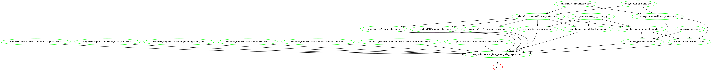

# Forest Fire Area Prediction

[](https://opensource.org/licenses/MIT)

**Research Question:** Can we accurately predict the size of a forest fire based on meteorological and soil moisture records?

In this project, we aim to predict the burned area of forest fires in the northeast region of Portugal. Forest fires are major environmental concerns with the potential of endangering human lives (Cortez and Morais, 2007). Here in BC, millions of acres of forests burn annually, damaging large swaths of forest and posing significant financial challenges. Being able to predict the size of the burned area of forest fires may significantly impact fire management and mitigation efforts.

### Data Set

We are basing our work on a study performed by Cortez and Morais (2007), which looks at forest fire burn sizes in Montesinho natural park in northeast Portugal. This study provides us data that consists of meteorological observations (such as temperature, wind, relative humidity etc.), soil moisture indices, and spatial data. The data set contains 517 observations with no missing data, where each row represents one fire monitoring instance. The column `area` is our target value containing the burned area and the other 12 measurements and indexes will be the features.

### EDA

Our EDA analysis includes preliminary information of the test data set (such as type of features, value counts etc.) and plots depicting the dependent variables (area) as a function of potential predicting features. From the EDA analysis, we found that our target variable, `fire area` is highly skewed to small values. We observe that the feature `day` is not significantly impacting the output as the burned area is equally distributed across different days of the week, thus we drop that feature from the analysis. We also note that the `month` feature is unbalanced with fewer observations for some specific months. In order to avoid overfitting on this unbalanced feature, we define a new variable `season`, and plot the burned are versus this new variable. Surprisingly and contrary to our expectations, the summer fires are not significantly larger than other seasons. We also plot the size of the burned area as a function of spatial locations of the forest, which shows that two particular locations with (`X`,`Y`)=(6,5) and (`X`,`Y`)=(8,6) have the largest burnt area. The pair plot between numerical variables shows that there are some outliers in the data that we have to be aware of when building the regression model. Finally, the correlation table (i.e. heatmap) of all features shows that some features such as \[`ISI` and `FFMC`\], \[`temp` and `FMC`\], \[`DC` and `DMC`\] are associated with high correlation coefficients. On the other hand, some features such as \[`DC` and `rain`\], \[`RH` and `DMC`\] has close to zero correlation.

### Analysis

To predict the size of wildfires, we are building a predictive regression model. First, we split our data set into train and test splits with an 80:20 ratio. Then, we use Cook's Distance method with a threshold of 4/n to detect and remove outliers from the data set. We use the Support Vector Regression (SVR) algorithm and Mean Absolute Error (MAE) and Root Mean Squared Error (RMSE) as the scoring metrics and perform cross-validation with 10 folds to tune the hyperparameters. Once our best model is found, we will evaluate it on the test set and report the scores. Our final report will contain a table of error metrics for the SVR model as well as a plot showing the predicted burned areas from our best model versus the observed burned areas to highlight the model's performance on unseen test data.

------------------------------------------------------------------------

## Report

The final report can be found [here](https://ubc-mds.github.io/forest-fire-area-prediction-group-2/reports/forest_fire_analysis_report.html).


## Usage

**1. Running on Docker**

1.  Clone/download this repository
2.  Run ` docker pull mvore/ffa-prediction` to get the container (make sure Docker is installed on your machine)
3.  Use the command line to navigate to the root of this project on your computer
4.  Run `docker run -it --rm -v /$(pwd):/home/ffa_prediction mvore/ffa-prediction`
5.  Navigate to `home/ffa_prediction` in the interactive terminal
6.  Call `make clean` to clear the repo and `make all` to run the analysis

**2. From Makefile**

1.  Clone/download this repository
2.  Create and activate a conda environment with all the dependencies using the following `conda` command.

``` bash
conda env create -f environment.yml
conda activate ffa_prediction
```

3.  Run all steps of analysis using the following make command from root directory of this project To run all the steps in the analysis using `make` from the root directory of the project.

``` bash
# Clean data, results, and reports
make clean

# Run all steps
make all
```

4.  To run the steps individually using `make` from the root directory of the project, run the following commands

``` bash
# Clean and split data
make data/processed/train_data.csv

# Exploratory Data Analysis
make results/EDA_day_plot.png

# Preprocess, cross-validate, and tune model
make results/cv_results.png

# Evaluate model
make results/test_results.png

# Render final report
make reports/forest_fire_analysis_report.md

# Run tests
make tests
```
**Dependency diagram of the Makefile:**



------------------------------------------------------------------------

**Dependencies**

Python:

      - pandas[version='>=1.3.*']
      - altair_viewer
      - requests[version='>=2.24.0']
      - matplotlib[version='>=3.2.2']
      - python-graphviz
      - altair
      - jinja2
      - graphviz
      - scikit-learn[version='>=1.0']
      - ipykernel
      - altair_saver
      - pip
      - docopt
      - dataframe_image
      - statsmodels
      - lxml
      - pytest[version='>=6.2.5']

R:

      - knitr==1.26
      - rmarkdown
      

------------------------------------------------------------------------

## References

P. Cortez and A. Morais. A Data Mining Approach to Predict Forest Fires using Meteorological Data. In J. Neves, M. F. Santos and J. Machado Eds., New Trends in Artificial Intelligence, Proceedings of the 13th EPIA 2007 - Portuguese Conference on Artificial Intelligence.

Data is publicly available at <https://archive.ics.uci.edu/ml/datasets/Forest+Fires>.
