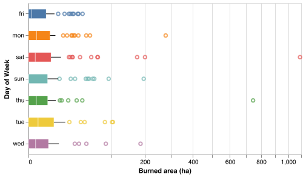
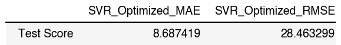

Predicting forest fire occurances in Northeastern Portugal
================
Margot Vore, Ana Einolghozati, Gautham Pughazhendhi, Hatef Rahmani
11/27/2021

-   [Summary](#summary)
-   [Introduction](#introduction)
-   [Methods](#methods)
    -   [Data](#data)
    -   [Analysis](#analysis)
-   [Results and Discussion](#results-and-discussion)
-   [References](#references)

# Summary

We have created a simple prediction model to predict the size of forest
fires using weather and soil moisture properties. We explore a data set
from northeastern Portugal that contains spatial features, temporal
features, soil moisture indices, and weather features to predict the
size of wildfires within the Montesinho natural park. We create a
Support Vector Regression (SVR) model using the soil moisture variables,
temperature, relative humidity, wind, spatial coordinates, and season.
After removing outliers using Cook’s Distance method, we optimize our
model using mean absolute area (MAE) and root mean square error (RMSE).
Our optimized model, with *C* = 1.88 and *γ* = 0.48, produces a MAE of
8.686 and an RMSE of 28.46 on the unseen test data set, which is good
for our area burned values which range from 0 to 1,090 ha.

# Introduction

Forest fires are a common occurrence in both British Columbia and
globally. In British Columbia, unprecedented amounts of forest have
burned in the recent decades, with over 1,350,000 ha burning in 2018
alone, costing the Canadian government over $615 million dollars
(British Columbia 2021). Due to the complexity and variability in
landscapes, fuel characteristics, climate patterns, and man-made
infrastructure, it is incredibly hard to determine how large a fire will
be, the intensity at which it will burn, and how it will move.
Predicting such fire characteristics would benefit local communities and
may influence resource allocation decisions during fire events. Our aim
is to create a machine learning model that can predict how much area a
particular fire will burn. While our model will be simple, it will begin
to explore the interactions between climate, soil properties, and area
burned by forest fires.

# Methods

## Data

For our simple prediction model, we have chosen a data set originally
used in P. Cortex, A. Morais (2007), which represents forest fire areas
in Montesinho natural park located in the northeastern region of
Portugal. The data, sourced from the UCI Machine Learning Repository
(Dua and Graff (2017)) (which can be found
[here](https://archive.ics.uci.edu/ml/datasets/forest+fires)), was
collected between 2000 and 2003 leading to 517 records. It consists of
two spatial features (x and y coordinates), two temporal features (month
and day of the week), four soil moisture indices for different soil
layers (FFMC (Fine fuel moisture code), DMC (duff moisture code), DC
(drought code), and ISI (initial spread index)), and four climatic
variables (temperature, rain, relative humidity, and wind).

Each record in the dataset also has an associated area burned value. The
burned area is highly skewed to smaller areas, with over 200 records
recording no fires. Large fires occur less frequently than small fires,
which explains the skewness, a phenomenon that is observed in countries
globally (P. Cortex, A. Morais 2007).

## Analysis

The Support Vector Regression (SVR) algorithm was used to build a
regression model to predict the burned areas of forest fires. The
variables `FFMC`, `DMC` , `DC`, `ISI`, `temp`, `RH`, `wind`, `X`, `Y`
and `season` were used to fit the model. The `day` and `rain` variables
were dropped for the training, and the variable `month` was feature
engineered into the `season` variable. Cook’s Distance method with a
threshold of $\\frac{4}{n}$ was used to detect and remove outliers from
the data set. The hyperparameters of *C* and *γ* were chosen using
10-fold cross-validation with Mean Absolute Error (MAE) and Root Mean
Squared Error (RMSE) as the regression metrics. The R and Python
programming languages (R Core Team 2019; Van Rossum and Drake 2009) and
the following R and Python packages were used to perform the analysis:
pickle (Van Rossum 2020), docopt (de Jonge 2018), knitr (Xie 2014),
NumPy (Harris et al. 2020), Pandas (McKinney et al. 2010), statsmodels
(Seabold and Perktold 2010), scikit-learn (Pedregosa et al. 2011), os
(Van Rossum and Drake 2009), Matplotlib (Hunter 2007). The code used to
perform the analysis and create this report can be found here:
<https://github.com/UBC-MDS/forest-fire-area-prediction-group-2>.

# Results and Discussion

To explore which features might be useful in predicting forest fire burn
areas, we made several graphs. Figure 1 shows that no clear relationship
between the burnt area of the forest and the days of the week exists.
Since some months such as January, May and November have few
observations making the `month` variable unbalanced, we create a
`season` variable to help avoid overfitting. From figure 2 we see that
there may be a relationship between burnt areas of forest and seasons,
thus we drop the `day` feature and replace the months with their
respective seasons.

Figure 3 plots the pairwise relationships between the numerical
variables of the dataset. We can see that the majority of the numerical
variables have different ranges of values for each season. In addition
to showing the patterns between the numerical variables, this plot also
reveals outliers in input features such as `FFMC`, `DMC`, `DC`, `ISI`
and `rain`. Since `rain` has mostly values of 0, we drop this variable.
To address outliers in the other variables, we use Cook’s distance for
detecting outliers.

The Cook’s distance method identified 4 observations as outliers as
shown in figure 4. Consequently, we removed these 4 observations from
our training data.

We chose to perform regression using the Support Vector Regression (SVR)
algorithm. To find the best model that predicted the burned forest area,
we performed 10-fold cross-validation with Mean Absolute Error (MAE) and
Root Mean Squared Error (RMSE) as the regression metrics. We observed
that the optimal *C* was 1.88 and the optimal *γ* was 0.48.

 

Table 1. Results from 10-fold cross-validation before and after
hyperparameter optimization

  Table 1 shows that the models improve slightly after hyperparameter
tuning. The mean train scores and the mean validation scores using both
MAE and RMSE seem to be fairly close to each other.

 

Table 2. Results from 10-fold cross-validation before and after
hyperparameter optimization

Table 2 reveals that the model performed similarly on unseen test data
when compared to the mean cross-validated validation scores when using
MAE. However, the model performs slightly better on the validation sets
compared to the test data when using RMSE. Furthermore, the MAE score is
less than the RMSE score which is sensible as we should normally have
*M**A**E* ≤ *R**M**S**E*. Both regression metrics express the average
prediction error in the units of hectares. It is also worth noting that
RMSE squares the errors before taking the average, which gives higher
weights to large errors. Therefore, considering RMSE would be more
useful when large errors are particularly undesirable.

Overall, we find that the model performs well on the test data as our
target variable `area` has a range of values from 0 to 1090.84 hectares.
Therefore, using both regression metrics, the errors provided in table 2
seem to be quite low in comparison to the range of values. Nonetheless,
in the context of burned areas of fire, large errors are particularly
undesirable, and as a result RMSE might be more useful as it gives more
weight to the observations further away from the mean – that is, being
off by 20ha will be more than twice as bad as being off by 10ha.

We understand that there are additional ways to improve our model and
results. While we have tried to compensate for this using Cook’s
distance to detect outliers, we could try another outlier detection
method to confirms our results. We can also employ feature selection
algorithms or transform our predictor variables by applying log-normal,
square root, or other transformations. Additionally, we can consider the
interactions between the variables within our model and apply polynomial
regression or consider other regression algorithms such as the random
forest algorithm which is robust to outliers and non-linear data.

# References

British Columbia, Government of. 2021. *Wildfire Averages*. Public
Saftey; Emergency Services.
<https://www2.gov.bc.ca/gov/content/safety/wildfire-status/about-bcws/wildfire-statistics/wildfire-averages>.

de Jonge, Edwin. 2018. *Docopt: Command-Line Interface Specification
Language*. <https://CRAN.R-project.org/package=docopt>.

Dua, Dheeru, and Casey Graff. 2017. “UCI Machine Learning Repository.”
University of California, Irvine, School of Information; Computer
Sciences. <http://archive.ics.uci.edu/ml>.

Harris, Charles R., K. Jarrod Millman, Stéfan J van der Walt, Ralf
Gommers, Pauli Virtanen, David Cournapeau, Eric Wieser, et al. 2020.
“Array Programming with NumPy.” *Nature* 585: 357–62.
<https://doi.org/10.1038/s41586-020-2649-2>.

Hunter, John D. 2007. “Matplotlib: A 2d Graphics Environment.”
*Computing in Science & Engineering* 9 (3): 90–95.

McKinney, Wes et al. 2010. “Data Structures for Statistical Computing in
Python.” In *Proceedings of the 9th Python in Science Conference*,
445:51–56. Austin, TX.

P. Cortex, A. Morais. 2007. *A Data Mining Approach to Predict Forest
Fires Using Meteorological Data*. J. Neves, M. F. Santos; J. Machado
Eds., New Trends in Artificial Intelligence, Proceedings of the 13th
EPIA 2007 - Portuguese Conference on Artificial Intelligence.
<http://www3.dsi.uminho.pt/pcortez/fires.pdf>.

Pedregosa, Fabian, Gaël Varoquaux, Alexandre Gramfort, Vincent Michel,
Bertrand Thirion, Olivier Grisel, Mathieu Blondel, et al. 2011.
“Scikit-Learn: Machine Learning in Python.” *Journal of Machine Learning
Research* 12 (Oct): 2825–30.

R Core Team. 2019. *R: A Language and Environment for Statistical
Computing*. Vienna, Austria: R Foundation for Statistical Computing.
<https://www.R-project.org/>.

Seabold, Skipper, and Josef Perktold. 2010. “Statsmodels: Econometric
and Statistical Modeling with Python.” In *9th Python in Science
Conference*.

Van Rossum, Guido. 2020. *The Python Library Reference, Release 3.8.2*.
Python Software Foundation.

Van Rossum, Guido, and Fred L. Drake. 2009. *Python 3 Reference Manual*.
Scotts Valley, CA: CreateSpace.

Xie, Yihui. 2014. “Knitr: A Comprehensive Tool for Reproducible Research
in R.” In *Implementing Reproducible Computational Research*, edited by
Victoria Stodden, Friedrich Leisch, and Roger D. Peng. Chapman;
Hall/CRC. <http://www.crcpress.com/product/isbn/9781466561595>.

