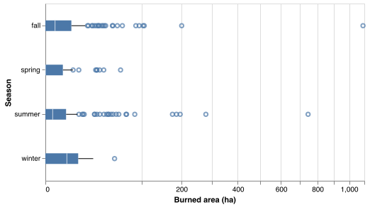
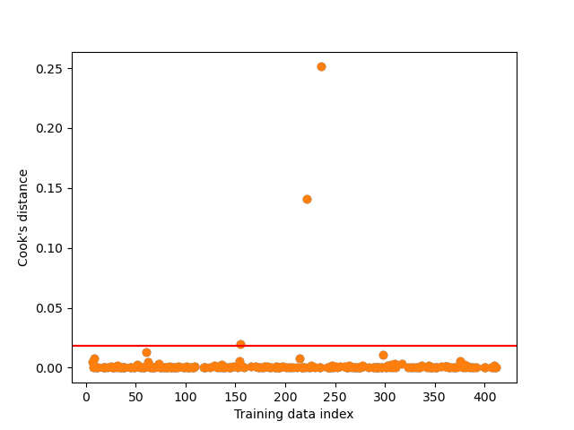
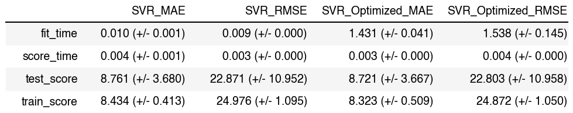

To look at whether each of the predictors might be useful in predicting the burned areas of the forest, we made several graphs. Figure 1 shows that there is no clear relationship between the burnt area of the forest and the days of the week. Since some months such as January, May and November do not have many observations, and since the `month` variable is unbalanced, to avoid overfitting, we create a `season` variable. From figure 2 we can see that there is a distinction between the burnt areas of forest and seasons. As a result, we are dropping `day` and will replace each month with their respective season.


```{r days_burnt_area, echo = FALSE, fig.cap="Figure 1. Distribution of burnt areas of the forest (sqrt transformed) per day of the week", out.width = '50%', out.height = '50%'}
knitr::include_graphics("../results/EDA_day_plot.png")
```

```{r season_burnt_area, echo = FALSE, fig.cap="Figure 2. Distribution of burnt areas of the forest (sqrt transformed) per season", out.width = '50%', out.height = '50%'}

```

Figure 3 plots the pairwise relationships between the numerical variables of the dataset. We can see that the majority of the numerical variables have different ranges of values for each season. In addition to showing the patterns between the numerical variables, this plot also reveals the outliers in the data. For example, the variables such as `FFMC`, `DMC`, `DC`, `ISI` and `rain` contain outliers. Since we can see that `rain` has mostly values of 0, we drop this variable. To deal with the other outliers in the other variables, we use Cook's distance for detecting outliers.


```{r pairwise_plot, echo = FALSE, fig.cap="Figure 3. Pairwise relationships between the numerical variables per season", out.width = '90%', out.height = '90%'}
knitr::include_graphics("../results/EDA_pair_plot.png")
```


The Cook's distance method, identified 4 observations as outliers as shown in figure 4. Consequently, we removed these 4 observations from our training data. 

```{r outlier_detection, echo = FALSE, fig.cap="Figure 4. Cook's distance outlier detection", out.width = '50%', out.height = '50%' }

```

We chose to perform regression using the Support Vector Regression (SVR) algorithm. To find the best model that predicted the burned forest area, we performed 10-fold cross-validation with Mean Absolute Error (MAE) and Root Mean Squared Error (RMSE) as the regression metrics. We observed that the optimal $C$ was $1.88$ and the optimal $gamma$ was $0.48$.

<br>

```{r cross-validation_results, echo = FALSE, out.width = '50%', out.height = '50%'}

```


Table 1. Results from 10-fold cross-validation before and after hyperparameter optimization

<br>
Table 1 shows that the models improve slightly after hyperparameter tuning. The mean train scores and the mean validation scores using both MAE and RMSE seem to be fairly close to each other.

<br>

```{r test_results, echo = FALSE, out.width = '40%', out.height = '40%'}
knitr::include_graphics("../results/test_results.png")
```

Table 2. Results from 10-fold cross-validation before and after hyperparameter optimization

Table 2 shows that the model did fairly similar on the test data compared to the mean cross-validated validation scores when using MAE. However, the model seems to perform better on the validation sets compared to the test data when using RMSE. Furthermore, the MAE score is less than the RMSE score which is sensible as we should normally have $MAE \leq RMSE$. Both regression metrics express the average prediction error in the units of our target variable which is hectares. It is also worth noting that RMSE squares the errors before taking the average, thus giving a relatively high weight to large errors. Therefore, considering RMSE would be more useful when large errors are particularly undesirable. 

Overall, we believe that the model performed fairly well on the test data as our target variable `area` has a range of values from $0$ to $1090.84$ hectares. Therefore, using both regression metrics, the errors provided in table 2 seem to be quite low in comparison to the range of values. Nonetheless, in the context of burned areas of fire, large errors are particularly undesirable, and as a result RMSE might be more useful since it gives more weight to the observations further away from the mean -- that is, being off by 20 will be more than twice as bad as being off by 10.

Although our data has variables that are highly skewed and contains outliers, we believe we created a model that performs fairly well on unseen data. However, the high skewness of some variables could affect our model. Moreover, we used Cook's distance to detect outliers. To make sure our detected outliers are robust, we can try another outlier detection method that confirms our results. To further improve this model in future with the hopes of creating a model with a lower prediction error, we can suggest several things. First, we would employ some feature selection algorithms. Moreover, we would try applying some transformations to the predictor variables such as applying log-normal, square root, etc. transformations. Additionally, we would try considering the interactions between the variables and use polynomial regression in our model. Furthermore, we could also try considering other regression algorithms such as the random forest algorithm, since it is robust to outliers and non-linear data.